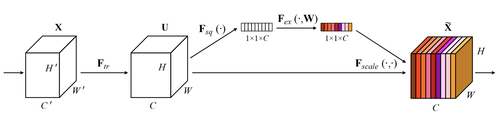
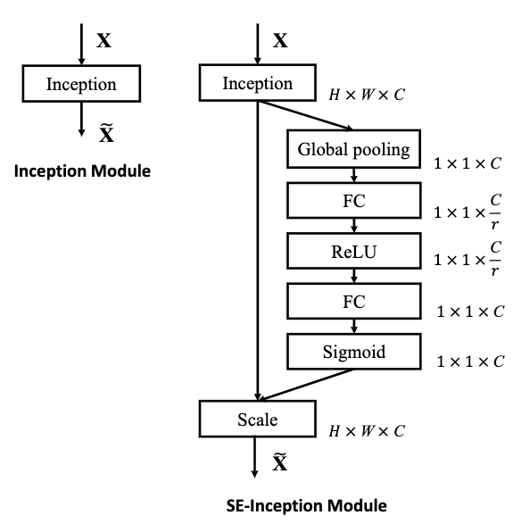
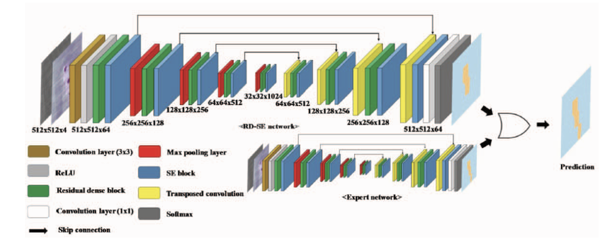
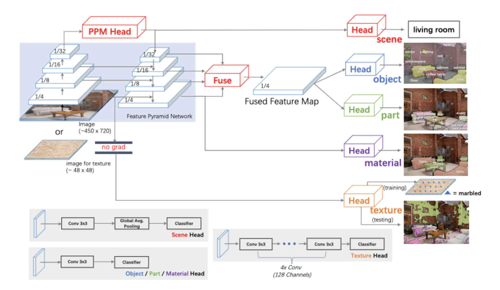

### 常用模块

[经典模块](https://www.cnblogs.com/xuanyuyt/p/11329998.html)

### SE block

核心是计算出一个权重向量，对特征图进行一个加权

### 第一届方案

**RD-SE**

一个RD块包括五层3x3卷积加一个BN，SE块就是正常的SE块

**focal loss + lovasz loss**

**输入channel加上image mask**

### 边界

[边界](./CVPR_2021_A Loss Function for Structured Boundary-Aware Segmentationpdf.pdf)

### FFT

[FDA](https://openaccess.thecvf.com/content_CVPR_2020/papers/Yang_FDA_Fourier_Domain_Adaptation_for_Semantic_Segmentation_CVPR_2020_paper.pdf)

### UPerNet

### segFix

代码+论文

### OCR+Upernet

已经修改好，正在实验测试阶段

### ISA

### 毕设实验部分

1.损失函数从交叉熵修改为混合损失

2.训练一个比较好的结果再修改混合损失的权重进行fine-tune

3.在UPerNet基础上加上OCR模块

对比实验（batch为2）：

1.同样的ConvNeXt+UPerNet，损失函数为交叉熵和混合损失

2.损失函数同为混合损失，加不加OCR模块对比

3.损失函数为混合损失，不加OCR，在开始对类别加权重和不加权重训练之后再加权重fine-tune对比
